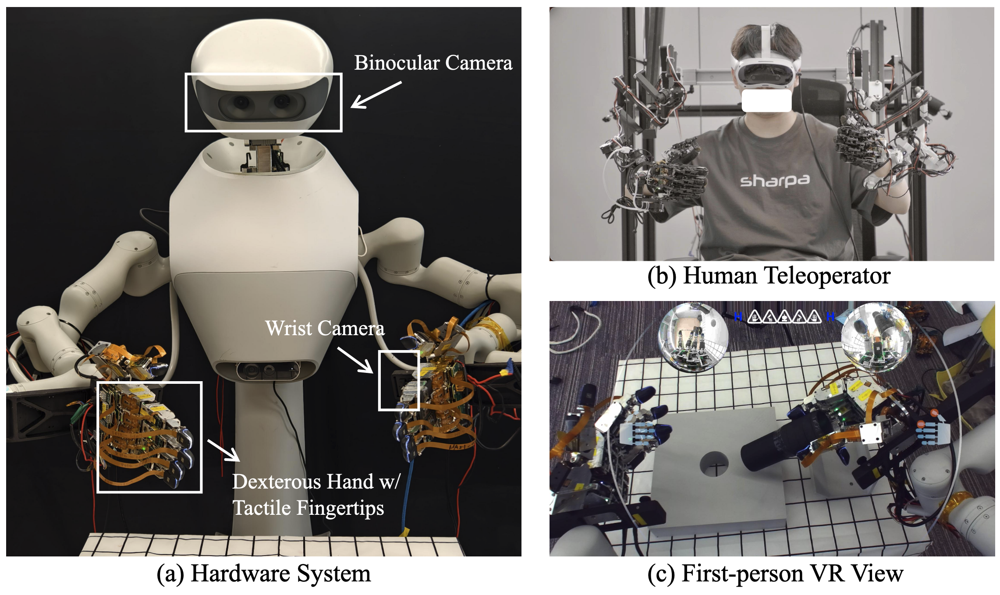

# ViTacFormer: Learning Cross-Modal Representation for Visuo-Tactile Dexterous Manipulation


<p align="center">
  <a href="https://roboverseorg.github.io/ViTacFormerPage/"></a>
  <a href="https://arxiv.org/abs/2506.15953"></a>
  <a href="https://github.com/RoboVerseOrg/ViTacFormer/issues"></a>
</p>

## Hardware Setup



Our hardware setup consists of an **active vision system**, a **bi-manual robot arm**, and **two high-DoF dexterous hands (SharpaWave)** equipped with **high-resolution tactile sensors**.

To enable rich data collection, we use a **teleoperation system** with **precision exoskeleton**  for fine-grained arm and finger control, plus a **VR interface** to control the camera and guide demonstrations.

## Installation

    conda create -n vitacformer python=3.8.10
    conda activate vitacformer
    pip install torchvision
    pip install torch
    pip install opencv-python
    pip install matplotlib
    pip install tqdm
    pip install einops
    pip install h5py
    pip install ipython
    pip install transforms3d
    pip install zarr
    pip install transformers
    cd dataset/ha_data && pip install -e .
    cd detr && pip install -e .

## Example Usages

Please download and unzip the example data [here](https://drive.google.com/file/d/1GzQSymfzw2YDY0VtCyutV5LnmFRbu0nm/view?usp=sharing). To train ViTacFormer, run:

    conda activate vitacformer
    bash train.sh

## Citation
If you find RoboVerse useful, please consider citing it:
```bibtex
@misc{heng2025vitacformerlearningcrossmodalrepresentation,
      title={ViTacFormer: Learning Cross-Modal Representation for Visuo-Tactile Dexterous Manipulation}, 
      author={Liang Heng and Haoran Geng and Kaifeng Zhang and Pieter Abbeel and Jitendra Malik},
      year={2025},
      eprint={2506.15953},
      archivePrefix={arXiv},
      primaryClass={cs.RO},
      url={https://arxiv.org/abs/2506.15953}, 
}
```
